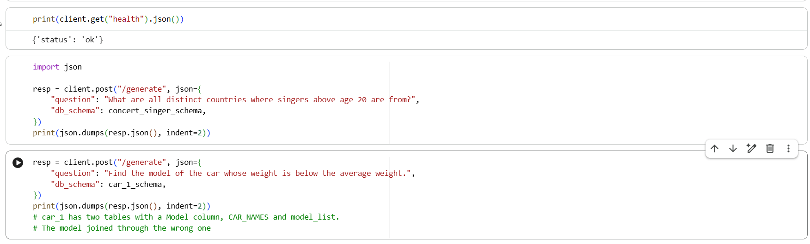

# Text-to-SQL Fine-Tuning (LoRA, Qwen2.5-Coder-3B)


[](LICENSE)

Fine-tunes `Qwen2.5-Coder-3B-Instruct` on the [Spider](https://yale-lily.github.io/spider)
text-to-SQL benchmark, with a statistically-backed before/after evaluation, execution-based validation against real databases, and a minimal serving
layer, built to demonstrate the full LLM engineering stack (data pipeline -> training -> rigorous evaluation -> deployment).

## Results

| | Base (zero-shot) | Base (3-shot) | Fine-tuned (LoRA, epoch 1) |
|---|---|---|---|
| Exact-set-match accuracy | 31.6% | 40.8% | 59.0% |
| n (full validation set) | 1,034 | 1,034 | 1,034 |

**Improvement: +27.4 points, 95% bootstrap CI [24.1, 30.7]:** this interval excludes zero, so this is a statistically real effect on this evaluation set. Confirmed by execution-based testing too: +8.9 points, 95% CI [6.6, 11.3] when measured by actually running the SQL against real databases rather than comparing parsed structure.

## Table of contents

- [What this measures](#what-this-measures)
- [Error analysis](#error-analysis)
- [How much did training actually buy?](#how-much-did-training-actually-buy)
- [Build vs. buy](#build-vs-buy-self-hosted-fine-tune-vs-a-hosted-api)
- [Execution-based accuracy](#execution-based-accuracy)
- [Key engineering decisions](#key-engineering-decisions)
- [Efficiency: adapter vs. merged](#efficiency-adapter-vs-merged)
- [Serving](#serving)
- [Known limitations](#known-limitations)
- [Architecture](#architecture)
- [Running it](#running-it)
- [Demo](#demo)
- [Repo layout](#repo-layout)

## What this measures

Both models were given the identical zero-shot prompt format (system
instruction + serialized schema + question, see `src/data.py`) and scored
with **exact-set-match**: generated and gold SQL are each parsed into
structural components (SELECT columns, DISTINCT usage, tables, WHERE
conditions, GROUP BY, HAVING conditions, ORDER BY, and LIMIT) via a
SQL parser (`sqlglot`), and compared as unordered & case/whitespace-
insensitive sets, so `SELECT name, age` and `SELECT age, name` are scored as equivalent.

Using this specific zero-shot prompt
and schema format, fine-tuning improved exact-match accuracy from 32% to
59%. This project does not claim that 32% represents the base model's best possible zero-shot performance - a different prompt format (few-shot examples, standard `CREATE TABLE` schema serialization) could raise the
baseline independent of fine-tuning. Comparing exact match-accuracy for both models is internally valid (identical conditions, isolating fine-tuning's effect) but the baseline's absolute value should not be read as a ceiling.

Structural comparison has limits: it can't distinguish a
different query from a differently-shaped one that returns identical
results, and in narrow cases the reverse. Execution-based testing was
added to check whether this.

## Error analysis

Every generated/gold pair is also classified into a single primary failure
category (`src/evaluate.py::categorize_error`), checked in order from most
to least structurally fundamental (tables -> columns -> distinct -> where ->
group -> having -> order -> limit), reporting only the first mismatch found:

| Category | Base | Fine-tuned |
|---|---|---|
| correct | 31.6% | 59.0% |
| wrong_tables | 23.3% | 12.3% |
| wrong_conditions | 17.9% | 16.2% |
| wrong_columns | 12.2% | 4.7% |
| wrong_grouping | 6.0% | 2.5% |
| wrong_distinct | 4.6% | 2.0% |
| wrong_ordering | 3.4% | 2.6% |
| wrong_having | 0.5% | 0.3% |
| unparseable | 0.5% | 0.3% |

Fine-tuning improved schema grounding: table-selection
errors nearly halved (241->127, a 47.3% reduction) and column-selection
errors dropped by roughly three-fifths (126->49, a 61.1% reduction). DISTINCT-usage errors also dropped (48->21, a 56.3% reduction). WHERE-clause condition correctness decreased slightly (185->168, 9.2% relative reduction). This makes
sense as schema-paired training examples directly teach "which
table/column for this kind of question," while getting filter logic,
deduplication, and other query-semantic details right is a different
and harder skill this fine-tuning data improved only slightly.

Because only the first mismatch is reported per
example, a category's count can shift simply because fewer examples are
now being caught earlier by a table/column mismatch, which surfaces
previously-masked mismatches further down the ladder for the first time, but not necessarily because that specific error type got objectively worse in the data.
Read the wrong_grouping/wrong_ordering upticks with that in mind.

## How much did training actually buy?

Experimented on improving the zero-shot baseline with no training by giving the base model a few solved examples directly in the prompt as few-shot/in-context learning, which costs no GPU time and no gradient updates. 3 fixed examples were prepended to every prompt, one example each of a plain single-table query, a query with JOIN, and a query with GROUP BY, selected deterministically from the first matching example of each shape found in the training split.

| | Base (zero-shot) | Base (3-shot) | Fine-tuned |
|---|---|---|---|
| Exact-set-match accuracy | 31.6% | 40.8% | 59.0% |

**Few-shot vs. zero-shot base: +9.2 points, 95% CI [6.6, 11.8]**
**Fine-tuned vs. few-shot base: +18.2 points, 95% CI [15.0, 21.4]**
Both intervals exclude zero. Roughly a third of the total improvement over zero-shot is available with no training, by showing the model three worked examples, but fine-tuning adds a further statistically real improvement on top of that.

Breaking this down by error category:

| Category | Base | Few-shot | Fine-tuned |
|---|---|---|---|
| correct | 31.6% | 40.8% | 59.0% |
| wrong_tables | 23.3% | 23.0% | 12.3% |
| wrong_columns | 12.2% | 5.5% | 4.7% |
| wrong_conditions | 17.9% | 22.1% | 16.2% |
| wrong_distinct | 4.6% | 1.7% | 2.0% |
| wrong_ordering | 3.4% | 2.8% | 2.6% |
| wrong_grouping | 6.0% | 3.8% | 2.5% |
| unparseable | 0.5% | 0.1% | 0.3% |
| wrong_having | 0.5% | 0.2% | 0.3% |

This round of few-shot prompting was able to fix most of the `wrong_columns` errors by itself (12.2% -> 5.5%), likely because column selection benefits from direct pattern-matching against the shown examples. `wrong_tables` improves with either approach, more so with fine tuning. `wrong_conditions` and `wrong_grouping` appear to get worse under few-shot than the plain zero-shot baseline, and fine tuning doesn't fully reverse this. However, this could be due to the first-match error selection method used here, with fine tuning's removal of earlier errors allowing later errors to be observed, while the base model obscures them with earlier errors, reporting a false number. For few-shot regression specifically, the three examples were selected for table/join/group-by logic, not for demonstrating WHERE-clause logic, so they might bias the model toward answers that don't generalize to conditions.

## Build vs. buy: self-hosted fine-tune vs. a hosted API

Same 1,034-example validation set & 3-shot examples, run against
`gpt-4o-mini` (OpenAI) with identical prompt discipline to the local
few-shot baseline above, scored with the same `exact_set_match` used
throughout this project, then re-validated with execution-based testing.

| | Local few-shot (base model) | API few-shot (GPT-4o-mini) | Self-hosted (fine-tuned) |
|---|---|---|---|
| Structural accuracy | 40.8% | 37.0% | 59.0% |
| Execution accuracy | 52.6% | 58.5% | 59.5% |
| Latency (s/query) | - | 0.818 | 2.583 |
| Cost per 1,000 queries | - | $0.11 | $0.17-0.38 |

**Pricing as of September 2026.**

### Local few-shot beats the API structurally

Qwen2.5-Coder-3B-Instruct, given the same 3 few-shot examples as
GPT-4o-mini, scores higher structurally: +3.8 points, 95% CI [1.0, 6.6], CI excluding 0. GPT-4o-mini's own house style
(adding aliases, qualifying columns) persisted almost as strongly with
3 demonstrations in-context as with none, while the smaller open model
conformed closely to gold's terse style. This specific comparison
(local few-shot vs. API) was not independently re-checked with
execution-based testing, only fine-tuned-vs-API was, but it would likely have returned better results for the API.

### Latency and cost

The API is faster per-query (0.818s vs. 2.583s), due to the optimized production serving infrastructure on OpenAI's side, rather than model size.

Self-hosted cost assumes a single AWS `g4dn.xlarge` (one T4), $0.526/hr
on-demand or $0.234/hr spot as of September 2026, running continuously
at the measured 2.583s/query throughput with 100% utilization (GPU
processing queries with zero idle time). This assumption
favors self-hosting more than any real use case would: the API is
billed per-token (elastic, $0 when idle), while a self-hosted GPU costs
money every hour it runs regardless of traffic. At high,
sustained query volumes, self-hosting's per-query cost can beat the
API's, but at low or bursty volume the API wins by default on cost.

### The fine-tuned-vs-API accuracy gap: revised by execution testing 

Structurally, fine-tuned beat the API by 22.0 points, 95% CI [18.6, 25.3]. Execution-based testing substantially revised this.

## Execution-based accuracy

Structural comparison can't distinguish an actually different query
from a differently-shaped one that returns identical real results (or,
in narrower cases, the reverse). Downloaded the real Spider SQLite
databases for all 20 databases the validation set uses
([HAL-9001/spider-databases](https://huggingface.co/datasets/HAL-9001/spider-databases),
a checksum-verified re-host of the official Yale release, verified the
SHA256 hash before use) and executed gold vs. generated SQL directly
against them (`src/execute.py`), comparing the returned rows.

| System | Structural accuracy | Execution accuracy | Failed to execute at all |
|---|---|---|---|
| Base (zero-shot) | 31.6% | 50.6% | 117 (11.3%) |
| Local few-shot | 40.8% | 52.6% | 111 (10.7%) |
| API few-shot (GPT-4o-mini) | 37.0% | 58.5% | 34 (3.3%) |
| Fine-tuned | 59.0% | 59.5% | 37 (3.6%) |

Rows compared as an ordered list when gold uses `ORDER BY`, otherwise as a multiset (`Counter`,
not `set`, so duplicate rows aren't silently collapsed). A gold query
that fails to execute is excluded from both numerator and
denominator, logged separately as a data/methodology problem rather
than a model result. Executed read-only (SQLite `mode=ro`), so the
database driver itself refuses any write regardless of what the query
says, independent of `_is_read_only`.

### Basic SQL validity differs sharply by system

Base and local few-shot fail to execute at all over 10% of the time, while
fine-tuned and the API both stay under 4%. Fine-tuning taught
valid SQL syntax for this domain, and GPT-4o-mini's general
pretraining SQL fluency is strong even with no fine-tuning at all.

### Structural scoring understated every system except the fine-tuned one

Execution accuracy exceeds structural accuracy for base (+19.0pt),
local few-shot (+11.8pt), and the API (+21.5pt), but is nearly
identical for fine-tuned (59.5% vs. 59.0%). Fine-tuning teaches the model to reproduce gold's exact structural conventions
closely enough that structural scoring is close to unbiased
specifically for that system, while every other system's real
capability was masked by cosmetic differences in aliasing, phrasing,
or query shape that don't change what the query actually returns.

### Build vs buy verdict

Structurally, fine-tuned appeared to beat the API by 22.0 points.
Measured by executing the SQL: **+1.0 point, 95% CI
[-1.5, 3.4]**. Most of the apparent structural advantage was GPT-4o-mini's verbose style being
penalized by structural comparison, not it getting more queries
semantically wrong. Fine-tuned still beats the base model by a
large margin either way (structural: +27.4pt [24.1, 30.7], execution:
+8.9pt [6.6, 11.3]).

**Verdict:** on accuracy, self-hosting the fine-tune does not
demonstrate a meaningful advantage over a cheap hosted API given the
same few-shot examples - the two are statistically indistinguishable
by execution. The cost analysis above remains the same: the API is
cheaper at low/bursty volume, self-hosting is only competitive at high
sustained volume. Cost/volume trade-off is the deciding factor.

## Key engineering decisions

**QLoRA -> plain LoRA:** Initially
implemented QLoRA (4-bit NF4 quantization + LoRA adapters). Direct profiling showed
the quantized model used only ~2.0GB of the training GPU's 15GB, so memory constraints weren't an issue on this hardware. Quantization was also the root cause of a
recurring `bitsandbytes`/mixed-precision dtype instability during
training (a stray internal `bfloat16` tensor crashing PyTorch's fp16
gradient scaler, regardless of every model- and trainer-level dtype
setting tried). Switching to plain LoRA on an unquantized fp16 model
(`transformers.AutoModelForCausalLM`, no `BitsAndBytesConfig`) resolved
the crash and cut per-step training time roughly 5-6x by
removing per-step dequantization overhead (~55-63s/step quantized ->
~10.3s/step unquantized, measured on the same hardware and batch config).

**Checkpoint selection via validation loss, not the last epoch.** Training
ran 3 epochs with per-epoch evaluation:

| Epoch | Train loss | Validation loss |
|---|---|---|
| 1 | 0.0935 | 0.2284 |
| 2 | 0.0388 | 0.2888 |
| 3 | 0.0137 | 0.3611 |

Training loss falls monotonically, validation loss rises after epoch 1, which is textbook overfitting. The epoch-1 checkpoint was selected as the final model, not the epoch-3 (last) checkpoint. All reported results use the epoch-1 checkpoint.

After noticing this overfitting trend from epoch-1 onward, several follow-up experiments were run to check whether that boundary was of the model/data or of the training method.

- **Experiment 1:** Doubled lora_dropout from 0.05 to 0.1 with the random seed (42) and all other hyperparameters held identical. Result: epoch-1 eval_loss = 0.2362, versus 0.2284 for the original dropout, a gap of 0.0078. It's 39x larger than the 0.0002 spread Experiment 2 attributes to checkpoint-granularity noise. The same overfitting shape was present at epochs 2/3 with validation loss rising after epoch 1. Mean token accuracy independently peaked at epoch 1 as well (0.936 -> 0.933 -> 0.933), agreeing with the loss signal. Regularising the adapter shifted the loss slightly but didn't change overfitting or epoch-1 checkpoint selection, indicating that this isn't a capacity-control issue.

- **Experiment 2:** Experimented with checkpoint granularity by switching from checkpointing only at epoch boundaries to every 100 steps for a 9x finer resolution, to check whether the coarse epoch-1 snapshot was missing a better point elsewhere. The minimum loss was found at step 200, eval_loss = 0.2282, which is 0.0002 lower than the original epoch-1 checkpoint's loss of 0.2284. It rose again at step 300 and partially recovered by 400, all indicating that these loss changes were noise.

This model, on this dataset, seems to move from learning to memorizing dataset noise early on in training, around the one-epoch mark, due to the model-size/dataset-size/task combination, not any particular training parameter tested.

**Train/validation database overlap: 0/166.** Verified directly
(`len(set(train_db_ids) & set(val_db_ids)) == 0`). The validation set
tests generalization to entirely unseen databases, not just unseen
questions on familiar schemas.

**Loss masking.** Only the assistant's SQL response tokens contribute to
the training loss (`labels` set to `-100` for every prompt/schema token,
following PyTorch's `CrossEntropyLoss` `ignore_index` convention). The
model is graded on generating correct SQL, not on reproducing the schema
text it was given.

**SQL parsing bugs in scoring:**

1. *WHERE-clause comparison wasn't actually set-based.* The original `get_component_sets` compared WHERE
conditions by calling `.flatten()` on the whole `Where` node rather than
on its condition (`.this`). `.flatten` returns the entire clause as an
un-split opaque string, meaning WHERE clauses were never actually
compared as an unordered set of conditions despite the code and docs
claiming exactly that (it happened to still catch operator/connective
differences, since those produce different literal text, but silently
failed the one case it was meant to handle: `age > 20 AND country = 'X'`
vs. the logically-identical `country = 'X' AND age > 20` scored as not
a match). Separately, the scorer didn't check for `LIMIT`, `DISTINCT`, or
`HAVING` at all initially. Fixed (explicit AND-conjunct
splitting that preserves comparison operators and never decomposes OR, and
added `distinct`/`having`/`limit` as scored components) and re-run against
the real, saved 1,034-example results: base accuracy moved
21.95%->21.0%, fine-tuned 51.26%->50.2%, both down by roughly the same
~1 point, consistent with correcting a symmetric measurement bias rather
than something that happened to favor one model.

2. *Table aliases and column qualifiers caused false mismatches.*
`get_component_sets` compared raw rendered SQL text for tables and
columns, which includes table aliases (`singer AS s` normalized to
`"singerass"`, never equal to gold's `"singer"`) and column qualifiers
(`s.name` never equal to gold's `name`). Found while
investigating an implausibly low accuracy score on the API comparison
that turned out to reflect the API's more verbose SQL style rather
than lower real accuracy. Fixed by stripping table aliases and column
qualifiers before comparison, and unwrapping SELECT-list aliases the
same way LIMIT/DISTINCT/HAVING were added previously. Re-run against
the same real, saved results: base accuracy moved 21.0%->31.6%,
fine-tuned 50.2%->59.0%, API few-shot 27.0%->37.0%, all three are
corrections in the same direction (undercounting). The
fine-tuned-vs-base statistically significant improvement changed from
+29.2 to +27.4 points but remained real and large. As a remaining gap:
stripping qualifiers can't distinguish two differently-aliased
references to the same table in a self-join 
or a qualifier pointing at a table not actually in scope
(e.g. `s.Sales` when `s` is aliased to `singer`, not `song`).

3. *Generated SQL truncated by `max_new_tokens` left a dangling
markdown fence.*

4. *String literal contents were being case-folded, same as
identifiers.*

`tests/test_results_reproduce_readme.py` pins the current (post-fix) numbers against regression, and `tests/test_evaluate.py` has a dedicated regression test for each of the four bugs.

**Tokenizer versioning:** Every
automated test for `src/serve.py` mocks the model and tokenizer to avoid needing a GPU in CI, which means they verify the
API's request/response contract, but can never catch a problem in the
actual model-loading code. Running an
actual server against the real merged model showed that `tokenizer.apply_chat_template` failed
with `chat_template is not set`, despite every mocked test passing. The error was that the tokenizer had
been saved by an older `transformers` version, and a newer one (installed
via `pip install -U` with only floor-pinned versions in
`requirements.txt`) expects the chat template stored differently. Fixed by loading the
tokenizer from the original model repo rather than the saved local copy
(the chat template is a property of the base model, untouched by LoRA
fine-tuning or merging, so no need to load it from
a local save in the first place), and by switching `requirements.txt` to
exact-pinned versions (`requirements-dev.txt` for test/lint tools).

## Efficiency: adapter vs. merged

Single-example generation latency measured on the same GPU, using the same 50-example sample (first 5 discarded as warmup), greedy decoding:

| Model | Latency (s/example) |
|---|---|
| Base (no adapter) | 2.439 |
| Fine-tuned, unmerged LoRA adapter | 5.408 (+121.8%) |
| Fine-tuned, merged (`merge_and_unload()`) | 2.583 |

An unmerged LoRA adapter **more than doubles** per-example latency versus
the base model on this hardware, because every adapted layer pays for a frozen base-weight matmul *and* a separate small adapter matmul, on every forward pass, at every generation step. Merging (`model.merge_and_unload()`, which computes `W_base + (B @ A * scaling)` once and folds it into ordinary weights) recovers 95.2% of that overhead, landing within ~6% of the base model's latency. Always merge the model before deployment to decrease unnecessary latency.
`src/serve.py` loads the merged model for this reason.

## Serving

**The read-only-SQL guardrail as an allowlist checking the whole tree:** `_is_read_only`
parses generated SQL with `sqlglot` and checks that every statement is
structurally a `SELECT`, rather than scanning for a list of "dangerous"
keywords (`DROP`, `DELETE`, ...). A keyword denylist is only as safe as the list is complete, and it false-positives on
harmless SQL where a banned word appears inside a string literal (e.g.
`WHERE note = 'please update your info'`). Checking statement type
structurally avoids both of these issues and correctly rejects stacked
`SELECT ...; DROP TABLE ...;` statements too. However this top-level-only
structural checking also has a gap where SQLite's grammar accepts a DML
statement as a CTE body, so
`WITH x AS (DELETE FROM t RETURNING *) SELECT * FROM x` parses as a
top-level `exp.Select` despite deleting data. `_is_read_only` also walks
the full tree (`find_all` across `Insert`/`Update`/`Delete`/`Drop`/
`Create`/`Alter`/`Merge`/etc.) so a write hidden inside a CTE is caught
too. A plain subquery position (`SELECT * FROM (DELETE ...) AS t`)
doesn't need this, since SQLite's grammar rejects it/sqlglot never parses it, but a CTE body is permissive enough to need an
explicit check. Adversarial testing (12 prompt-injection-style natural-language
inputs, run through `generate_sql` against schemas) found the
model itself has no resistance to task-hijacking or role-play prompts, meaning
that it will write a destructive `UPDATE` if asked directly, which is
why this guardrail exists as a separate enforcement layer
rather than relying on the model. A model steered
into ignoring the actual question but still emitting syntactically
valid, harmless-looking SQL (e.g told to always answer `SELECT 1`)
passes this guardrail cleanly, since it checks safety, not
faithfulness to the question.

**Weak schema consistency check:**
`/generate` also returns `schema_consistent`: whether every table the
generated SQL references appears (as a whole word) somewhere in the
`db_schema` string the caller supplied. This catches the simplest hallucinations: a generated query naming a table that
was never mentioned in the schema at all. `db_schema` is a free-form string with no fixed
serialization enforced here, so the check is a whole-word,
case-insensitive substring search per table name, not a structural
schema parse. A table name appearing
somewhere in the text doesn't guarantee it was declared there as a table vs as a column, and it returns `null` rather than `false`
when the SQL doesn't parse or references no tables at all, since "no
signal" and "inconsistent" should be treated differently by the caller. A real per-database schema (structured
table/column lists, not a string) would let this be a precise check
instead of a heuristic one. CTE alias names (e.g. the `x` above) are
excluded from the referenced-tables set because sqlglot
represents a CTE reference identically to a real table reference.

## Known limitations

- **`get_component_sets`'s "tables" set doesn't distinguish a CTE alias
  from a real table.** sqlglot represents a CTE reference (e.g. the `x`
  in `WITH x AS (...) SELECT * FROM x`) as an `exp.Table` node
  structurally identical to a real table reference, so a generated query
  that wraps a correct answer in a CTE would currently score as
  `wrong_tables` against a gold query that doesn't use one, even though
  the two are semantically identical. Not currently affecting the
  numbers because none of the committed generations use a CTE, but it's
  a latent gap in the scorer. `src/serve.py`'s
  `_schema_consistent` (a separate function) excludes CTE aliases
  correctly but `get_component_sets` doesn't yet.
- **Stripping table aliases and column qualifiers has trade-offs:** it can't distinguish two differently-aliased
  references to the same table in a self-join (up to
  113/1,034 gold queries, 10.9%, structurally reference the same table
  twice, though not all necessarily hit an actual naming collision),
  and it can no longer catch a qualifier pointing at a table not
  actually in scope (e.g. `s.Sales` when `s` is `singer`, not `song`).
  Execution-based accuracy isn't affected by this since it checks
  real returned rows rather than structural text.
- **JOIN `ON` conditions are not compared.** `get_component_sets`
  checks SELECT columns, tables, WHERE, GROUP BY, HAVING, ORDER BY,
  and LIMIT, never the join condition itself, meaning two queries referencing
  the same tables/columns but joined on a different relationship can
  score as structurally identical. Up to 408/1,034 (39.5%) of gold
  queries contain a JOIN and are theoretically exposed. The number of
  rows where this actually flips the verdict is smaller and not fully
  quantified, and observed directly in a small number of cases during
  execution-based testing. To fix walk `exp.Join` nodes' `on` conditions with the
  same AND-conjunct-set treatment WHERE already gets, alongside the
  compound-query fix below, since the two interact.
- **Compound queries (UNION/INTERSECT/EXCEPT) only compare the first
  SELECT.** `get_component_sets` uses `tree.find(exp.Select)`, which
  returns only the first match in document order. A compound query's
  second half is invisible to column/WHERE comparison, while `tables`
  (via `find_all`) correctly still covers both halves. 
  Affects 76/1,034 (7.4%) of gold queries.
- **Double-quoted string literals are ambiguous in SQLite by design,
  not just in this scorer.** SQLite treats a double-quoted token as an
  identifier if it matches a real column, and falls back to a
  case-sensitive string literal otherwise. This is a schema-aware runtime
  decision a static parser can't replicate.
  `sqlglot` parses `"Little Lever Urban District"` as a column
  reference regardless of what SQLite ultimately does with it at
  execution time. A small number of gold queries in this dataset use
  this convention, so structural scoring can diverge from execution
  results specifically for them.
- **Possible benchmark contamination.** Spider is a long-public dataset.
  Qwen2.5-Coder's pretraining corpus may include some of it, meaning
  baseline zero-shot performance could reflect memorization rather
  than pure schema-grounded reasoning. This doesn't invalidate the
  before/after comparison (both models are equally exposed to whatever
  contamination exists), but it does mean the baseline number shouldn't be
  read as a clean measure of "true" zero-shot ability.
- **Evaluated with greedy decoding only.** Deliberate, for reproducibility
  of the paired statistical comparison. Haven't tested with
  beam search or sampling-based decoding yet.
- **`categorize_error`'s first-match-wins ordering** (see Error analysis)
    means category-level shifts should be read as directional signal, not
  as an actual count of every error type present.
- **Generation truncation:** Character-length distribution
  of the committed `results/` generations: max 437 chars (base) / 431
  chars (fine-tuned), p99 ~310-316 chars, generally within the 128-token
  cap, but truncation did occur on a small number of the longest and
  most complex queries. Added guard for cleaning of truncated outputs.

## Architecture

```
Spider (xlangai/spider)          spider-schema (richardr1126/spider-schema)
   question + gold SQL  -> join by db_id <-  table/column schema
              │
              ▼
   ChatML prompt (system + schema + question) -> tokenize -> mask prompt tokens
              │
              ▼
   Qwen2.5-Coder-3B-Instruct (fp16) + LoRA adapters (r=16, 0.96% trainable)
              │
              ▼
   SFTTrainer, 3 epochs, checkpoint selected by validation loss (epoch 1)
              │
        ┌─────┴─────┐
        ▼           ▼
  generate_sql   generate_sql
  (base model)   (fine-tuned)
        │           │
        └─────┬─────┘
              ▼
   exact_set_match + categorize_error (sqlglot-based structural comparison)
              │
              ▼
   paired bootstrap 95% CI on accuracy delta
              │
              ├──────────────────────────────┐
              ▼                               ▼
   merge_and_unload() -> merged model    execution-based validation
   -> latency benchmark -> FastAPI       (SQLite databases,
   /generate endpoint                    src/execute.py)
```

## Running it

```bash
pip install -r requirements.txt

# Train (writes checkpoints/checkpoint-<step>/ per epoch + checkpoints/final/)
python -m src.train

# Serve (expects a merged model at checkpoints/merged/, produced via
# model.merge_and_unload().save_pretrained("checkpoints/merged"))
uvicorn src.serve:app --reload
# POST /generate {"question": "...", "db_schema": "table : col (type), ..."}

# or containerized (mounting merged model into the container):
docker build -t sql-finetune .
docker run -p 8000:8000 -v $(pwd)/checkpoints:/app/checkpoints sql-finetune

# Tests (no GPU required, tests structural SQL comparison, execution-based
# comparison against a small in-memory SQLite database, prompt/masking
# logic, the FastAPI routing/validation contract, and a regression check
# that the real results in results/ reproduce every number claimed in
# this README)
pip install -r requirements-ci.txt
pip install -r requirements-dev.txt
pytest tests/ -v

# Lint (matches CI)
ruff check .
```

**Dependency files** `requirements.txt`
is the full project (training + serving). `requirements-serve.txt` is
what the Docker image installs - everything `src/serve.py`
needs to run, and nothing `src/train.py`-only. `requirements-ci.txt` is what CI installs, for tests instead of Docker, plus `datasets` (needed
transitively because `test_data.py` imports `src.data`) but never torch
(tests import it lazily).
`requirements-core.txt` is the package list common to the other two, so
a shared version only needs to change in one place.

## Demo

A short walkthrough of the running FastAPI server showing a generation, a schema-mismatch case, input validation and the read-only guardrail catching a destructive statement inside a CTE.



## Repo layout

```
src/
  data.py       # Spider + schema loading, prompt formatting, loss masking
  train.py      # LoRA config, SFTTrainer setup and training loop
  evaluate.py   # generation, cleaning, exact-set-match, error categorization,
                # paired bootstrap
  execute.py    # execution-based accuracy: run gold/generated SQL against
                # real SQLite databases, compare returned rows
  serve.py      # FastAPI serving layer (merged model, read-only-SQL guardrail)
results/
  base_results.json, finetuned_results.json, fewshot_results.json,
  api_results.json  # full 1,034-example generations for all four systems
tests/
  test_data.py                    # prompt formatting + masking-boundary correctness
  test_evaluate.py                # exact-set-match + error categorization, incl. the
                                   # real over-join example that motivated structural
                                   # (not text) comparison, and regression tests for
                                   # all scoring bugs found and fixed
  test_execute.py                 # execution-based comparison, against a small
                                   # in-memory SQLite database (no external data
                                   # dependency)
  test_serve.py                   # API contract + read-only-SQL guardrail
  test_results_reproduce_readme.py  # regression guard: real results -> exact
                                     # numbers claimed in this README
Dockerfile          # containerizes src/serve.py
LICENSE             # MIT
pyproject.toml      # ruff lint config (enforced in CI)
```